As of today, Discord is one of the most popular chat apps, especially for gamers and devs. People love it because it's free, it's efficient, it's cross-platform, it's... well, you guessed it, it's awesome. One of the great things you can do on Discord is to integrate bots on servers in order to make it more interactive. As an example, you may have encountered one of them that congratulates you and upgrades your level after you've sent many messages in the server. Or another one that allows you to listen to music using commands, to kick or ban members, etc.

As I'm a developer, I wondered how to build a bot. How do I create commands? Listen to messages? Deploy a bot? Turns out it's easier than what I've thought. So, without further ado, let's get started on how to create a Discord bot.

_Note: I work mainly with JS. So you guessed it, this bot will be written in JS!_

## Getting Started

For this tutorial, you need [Node.js](https://nodejs.org/en/) and [npm](https://www.npmjs.com/) or [yarn](https://yarnpkg.com/lang/en/) installed.

As usual, you always have to do some setup when starting out a project. Here are the four main things we will do:

1. Setup our local project
2. Create a Discord app and grab a token to use their API
3. Create a test server and add the bot on this server
4. Test our bot

Easy peasy!

### Setup our local project

All right, no more talking. First, you will need to create a folder and initialize it:

```sh
mkdir my-bot
cd my-bot
npm init -y # generates you a minimal package.json file
```

Then, we will need to import a library that allows us to interact with [Discord's API](https://discordapp.com/developers/docs). And luckily for us, there is one great JS wrapper called [discord.js](https://discord.js.org/#/). Let's add it to our project:

```sh
npm install discord.js
```

If we take a look at their website, we can see they already provide us some code to get started, how nice is this. We'll shamelessly copy-paste their example.

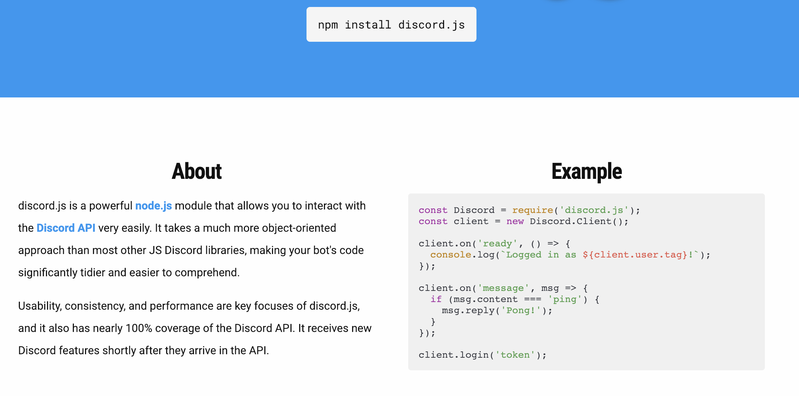

In your folder, create a new file called `index.js` and paste the following:

```js
const Discord = require('discord.js')
const client = new Discord.Client()

client.on('ready', () => {
  console.log(`Logged in as ${client.user.tag}!`)
})

client.on('message', msg => {
  if (msg.content === 'ping') {
    msg.reply('Pong!')
  }
})

client.login('token')
```

What does the code above do? Not so many things.

- We require `discord.js`'s library and initialize it by calling `Client()`.
- Then we listen for some events such as `ready` and `message` via the `on` method and we tell how to handle these events with a callback function.
- At the end of the code, we call the `login`. It establishes a websocket connection to Discord. But, as you can see, we need to provide a token to that method. Indeed, Discord requires you to have a key/token in order to use their API. Thus, we'll grab one to make it work.

### Get that token

1. Head over to [Discord's developer page](https://discordapp.com/developers/applications/) and click on **Create an application**.

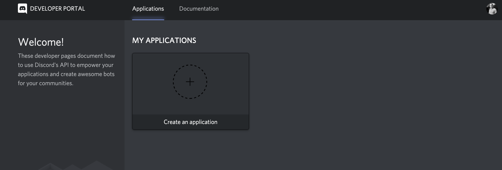

2. Fill the **NAME** field and choose an avatar if you want. In my case, I chose to name it _Tommy the Bot_ and to make it look like Wall-E. Then click on **Save changes**. You should see a feedback message telling _"All your edits have been carefully recorded."_

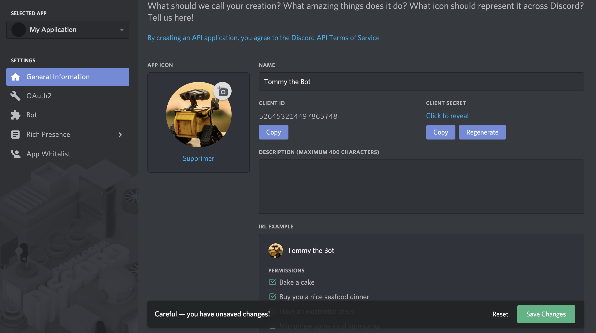

3. On the left panel, click on **Bot**, then click on **ADD BOT**.


4. A popup should appear, click on **Yes, do it!**. Depending on the name of your app, you can see an error message telling you _"Too many users have this username, please try another."_. In that case, choose another name for your app. (I'm sorry for you if one of your fancy names was taken 😏)


5. After that, you should see a success message telling you _"A wild bot has appeared!"_.

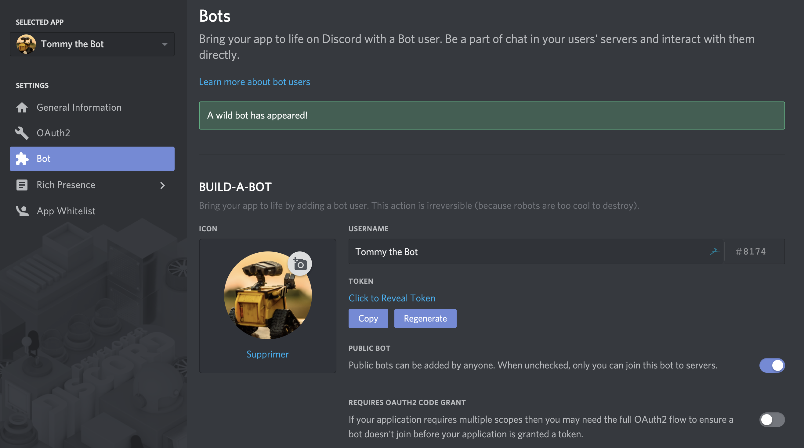

6. Below **TOKEN**, click on **COPY** and paste it in `index.js` as a parameter of the `login` method. Voilà! You are now the happy owner of a Discord bot token.

```js
client.login('YOUR_TOKEN')
```

So far, we've done the setup, grabbed the token. There are two steps remaining: add our bot to a server and test it.

### Add our bot to a server

Now, we are going to add the bot to a server, but for that, we need at least one server. If you don't have yet created a server, here is how to do it (I recommend you to create a test server):

1. After you logged in in [Discord](https://discordapp.com/), click on the **+** icon on your servers list:


2. A popup should appear. Click on **Create a server**.

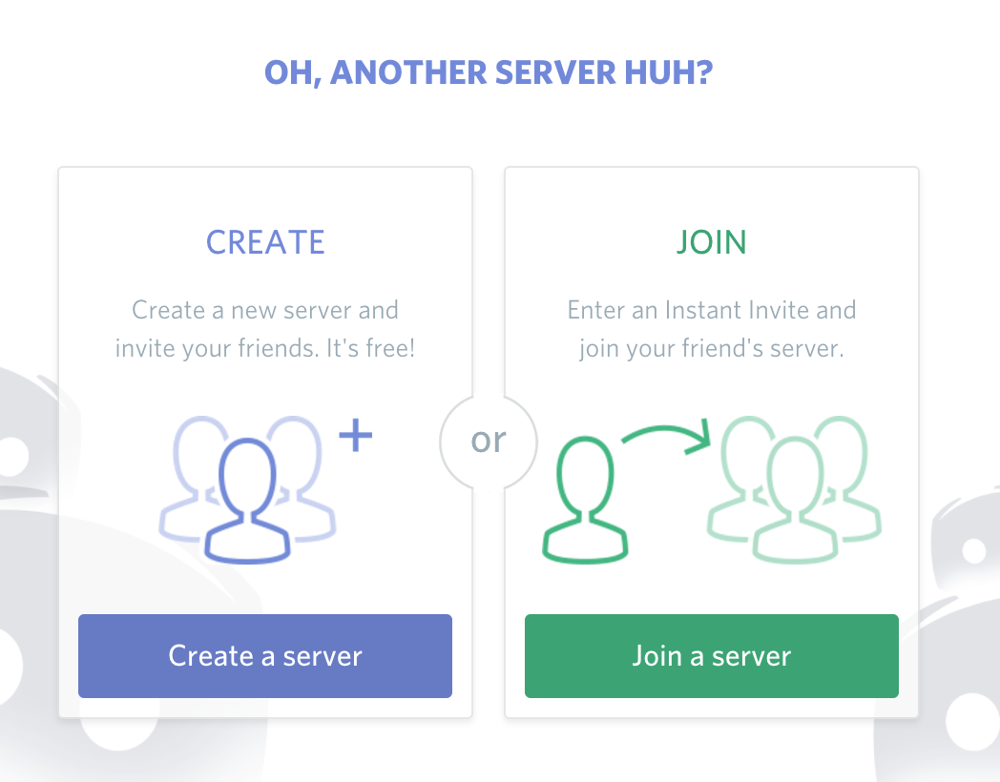

3. Fill in the **SERVER NAME** field and choose the **SERVER REGION** depending on your location (the closest, the better).

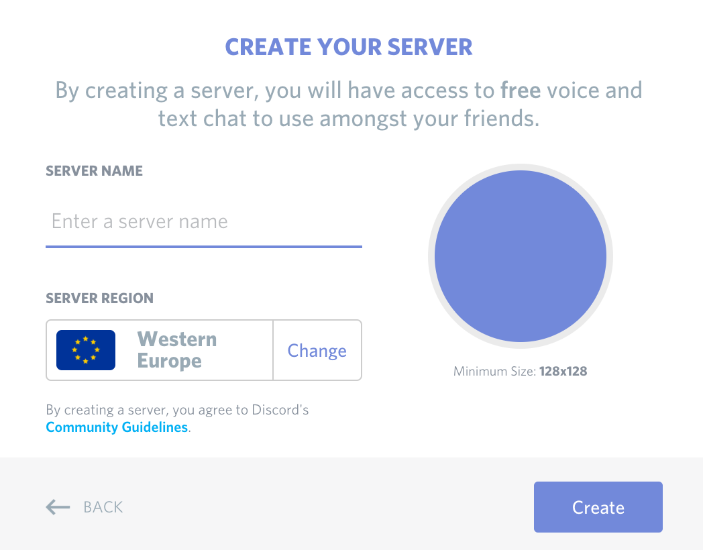

Great. Now we're ready to add our bot to our server:

4. Go back to the developer portal and click on **OAuth2** in the left panel. Under **SCOPES**, select **bot**. Finally, click on **Copy**.

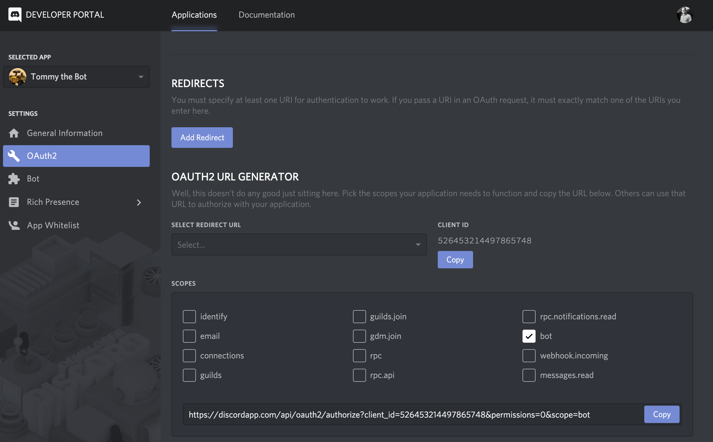

5. Open a new tab and paste in the URL the one you've just copied. Select your server and click on **Authorize**.


6. Your bot is added! Go in the Discord app and check for your bot in the list of users.

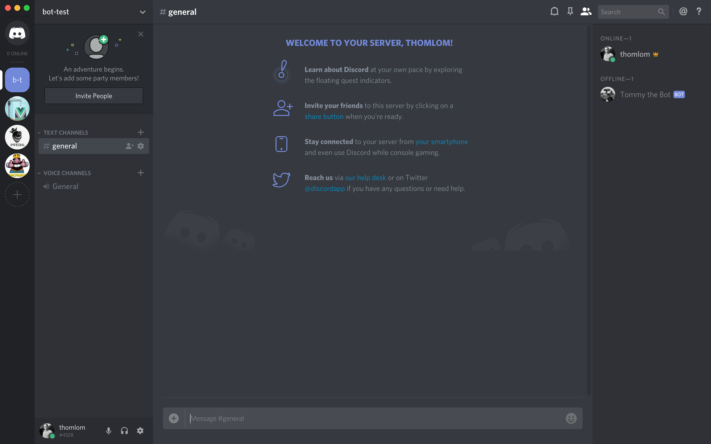

### Give life to your bot

Our bot is on our server but it's offline. So let's make it alive. For development purposes, we will add [`nodemon`](https://nodemon.io/). It will allow us to reload our code as soon as it changes:

```sh
npm install nodemon --save-dev
```

Then, we will add some scripts to our `package.json` to make our life easier. One will be called `start` and the other one `dev`. Paste the following in your `package.json` file:

```json
{
  "name": "my-bot",
  "version": "1.0.0",
  "main": "index.js",
  "scripts": {
    "start": "node index.js",
    "dev": "nodemon index.js"
  },
  "dependencies": {
    "discord.js": "^11.4.2"
  },
  "devDependencies": {
    "nodemon": "^1.18.9"
  }
}
```

Ladies and gentlemen, this is the moment you've been waiting for. Your bot is going to be brought online! Run this command:

```sh
npm run dev
```

If all went well, you should see this in your terminal:


Go back to your Discord test server, you should see your bot online. Send _ping_ in the **general** channel, your bot will reply **Pong!**. Amazing!

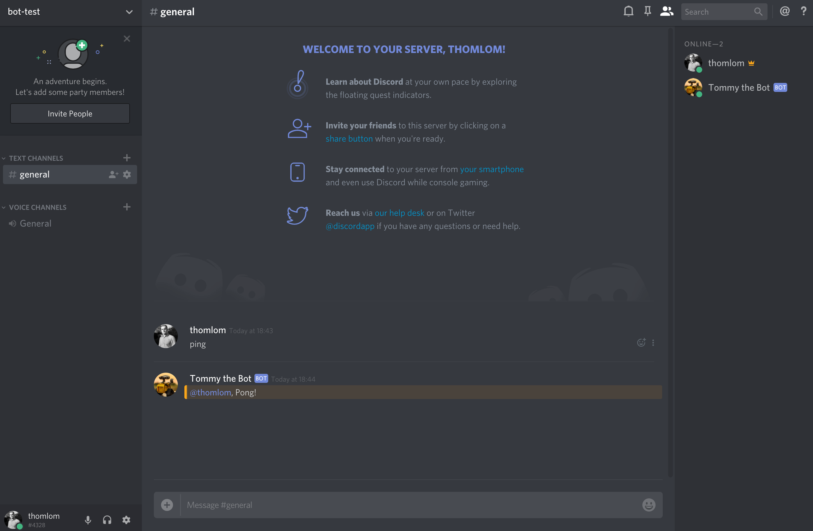

## Hide that token

When you grabbed your token, you may have noticed that Discord hid it by default. They did it because it's a sensitive data. Indeed, you can do whatever you want with the bot with that token. So if somebody steals it, bad things can happen. As a consequence, we need to hide our token from the source code in case you push it on GitHub for example.

To hide data, we use what we call environmental variables. Basically, we put what we want to hide or configuration variables into a file whose name is `.env`. This file should **never** be pushed on a public repository if it contains sensitive data. Create a new file called `.env` and paste the following:

```env
BOT_TOKEN=YOUR_TOKEN_HERE
```

Of course, don't _literally_ paste `YOUR_TOKEN_HERE`. Paste your own token.

The next step is to load this variable into our app. Indeed, you may have added a `.env` file, it will mean nothing to Node when it will run your `index.js` file. For that, we will add a package called [`dotenv`](https://www.npmjs.com/package/dotenv). As their docs say, dotenv is a module that loads environment variables from a `.env` file into `process.env.`:

1. Run `npm install dotenv`
2. At the very top of your `index.js` file, add this line:

```js
require('dotenv').config()
```

3. Replace your token with `process.env.BOT_TOKEN`:

```js
client.login(process.env.BOT_TOKEN)
```

Go back to your server and make sure your bot is still online. Alternatively, you can also check your terminal and double-check you didn't get any errors.

## Welcome new members

So far, our bot replies **Pong!** whenever someone says ping. Let's face it, it's totally useless. One of the common features of bots is to welcome members and give them instructions as soon as they join the server. Therefore we will code our bot so that whenever someone joins the server, it will send a welcome message!

There is a special event emitted when a user joins the server whose name is `guildMemberAdd`. The [member](https://discord.js.org/#/docs/main/stable/class/GuildMember) that just joined the server is passed as an argument and it has a loooot of methods including an interesting one called `send`. It will allow us to create a direct message between the bot and the new member. Beneath the last listener (`message`), add the following:

```js
client.on('guildMemberAdd', member => {
  member.send(
    `Welcome on the server! Please be aware that we won't tolerate troll, spam or harassment. Have fun 😀`
  )
})
```

To verify that everything works properly, invite a friend (or create another Discord account) and verify that they get the welcome message:

1. Click on the server's name then click on **Invite People**.
2. Copy the invitation's link and send the invitation link to the person you want to invite.
3. Make sure the bot welcomes the person as soon as he joins the server.

## Kick them all

Our bot starts to become interesting. Let's add a moderation feature: the ability to kick users by mentioning them. A simple `!kick @user` and **BAM!** The user is kicked out of the server. If we think of this feature, what should we do?

1. Detect that we are trying to kick someone. For that we must verify the message received starts with `!kick`.
2. Get the user mentioned. We can access it easily by taking the first member mentioned in the message.
3. As in every app, we must determine the edge cases. For example, a user could kick a user that doesn't exist or just say `!kick`. So we need to verify we've got a real member.
4. One of the members may not be kickable (for example the server's adminstrator or a bot). A [`kickable`](https://discord.js.org/#/docs/main/stable/class/GuildMember?scrollTo=kickable) property exist on the `GuildMember` object to know it.
5. Kick the member. We can do so with the [`kick()`](https://discord.js.org/#/docs/main/stable/class/GuildMember?scrollTo=kick) method. It returns a Promise. If the Promise is resolved (the kick was successful), the bot will reply it has successfully kicked the user. If not, the bot will say it was unable to do so.

Here is the full code (I got rid of the ping-pong feature):

```js
client.on('message', message => {
  if (message.content.startsWith('!kick')) {
    const member = message.mentions.members.first()

    if (!member) {
      return message.reply(
        `Who are you trying to kick? You must mention a user.`
      )
    }

    if (!member.kickable) {
      return message.reply(`I can't kick this user. Sorry!`)
    }

    return member
      .kick()
      .then(() => message.reply(`${member.user.tag} was kicked.`))
      .catch(error => message.reply(`Sorry, an error occured.`))
  }
})
```

### Giving the permission to the bot

> Wait. I tried to kick someone and that stupid bot keep saying me it can't kick that user!

That's normal. The bot doesn't have yet the permission to kick someone. Therefore, we'll create a **bot** role that gives the permission to kick members and we'll assign this role to our favorite little bot.

1. Go to your Discord app and click on your server's name then on **Server Settings**

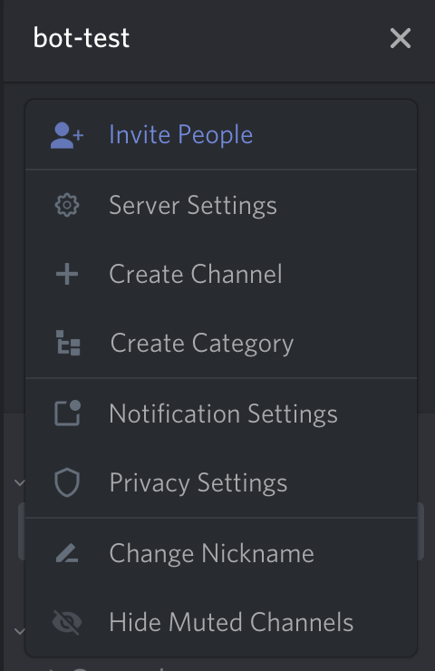

2. Click on **Roles**, then on the + icon. Add a name to the role. Then, in the list of permissions, scroll until you find **Kick Members** and toggle the switch.

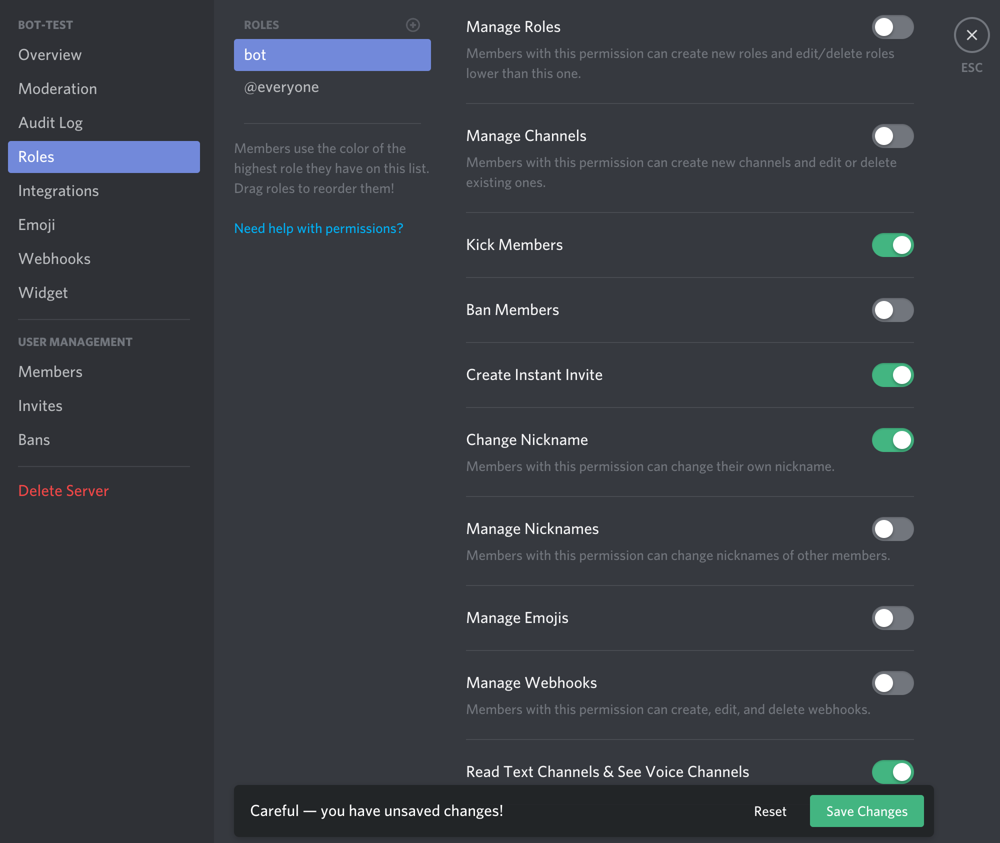

3. Click on **Members** on the left side panel, Then click on the rounded + icon next to your bot and add the **bot** role.

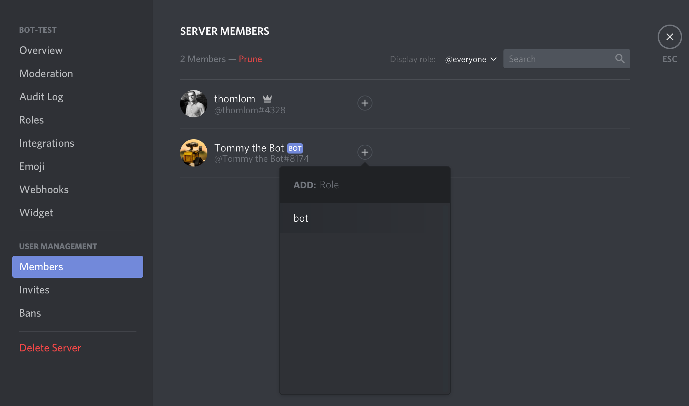

Now, you're good to go. Go back to your Discord app and make sure you can kick users. Try to kick yourself and admire how the bot tells you you can't kick yourself.

## Refactoring the code

As your app grows, you won't keep all your code in the `index.js` file. So, in this part, we will refactor the code and prepare the code for the next features.

### Events

Currently we have three events: `ready` when the bot is ready, `message` each time a message is sent to the server, `guildMemberAdd` whenever a user joins the server. There are a lot of other events that you can find [here](https://discord.js.org/#/docs/main/stable/class/Client).

To modularize our code, we will create an `events` folder. This folder will contain `.js` files whose name will match the different events name `discord.js` listens to:

1. Create an `events` folder.
2. In this folder, create three files: `ready.js`, `message.js` and `guildMemberAdd.js`.

Get ready for the following, it's harder than what you've seen until here.

For each `.js` file in the `events` folder, we will export a function which will be our **event handler**, that is to say, the function that runs each time the corresponding event is emitted. To do that, we will need to pass arguments to these event handlers such as `message`, `member`, etc.

1. We need to work with files. Then in `index.js`, you have to import the [`fs`](https://nodejs.org/api/fs.html) module at the top of your file

```js
const fs = require('fs')
```

2. Just below the initialization of the Discord client (`const client = new Discord.Client()`), read all the files of the events folder using [`fs.readdir`](https://nodejs.org/api/fs.html#fs_fs_readdir_path_options_callback). The callback has two arguments: `err` and `files` where `files` is an array of the filenames in the directory.

```js
fs.readdir('./events/', (err, files) => {})
```

3. Inside the callback function, we are going to require each event handler using the filename:

```js
fs.readdir('./events/', (err, files) => {
  files.forEach(file => {
    const eventHandler = require(`./events/${file}`)
  })
})
```

4. Now, listen to these events and add the associated event handler. We will need to pass the argument and the client to that event handler. Be careful though, the filename includes the extension! You'll get something like `ready.js` instead of just `ready`. So we must get rid of that extension.

```js
fs.readdir('./events/', (err, files) => {
  files.forEach(file => {
    const eventHandler = require(`./events/${file}`)
    const eventName = file.split('.')[0]
    client.on(eventName, arg => eventHandler(client, arg))
  })
})
```

5. Update each event handler file with the associated function and of course don't forget to export the function.

**ready.js**

```js
module.exports = client => {
  console.log(`Logged in as ${client.user.tag}!`)
}
```

**message.js**

```js
module.exports = (client, message) => {
  if (message.content.startsWith('!kick')) {
    const member = message.mentions.members.first()

    if (!member) {
      return message.reply(
        `Who are you trying to kick? You must mention a user.`
      )
    }

    if (!member.kickable) {
      return message.reply(`I can't kick this user. Sorry!`)
    }

    return member
      .kick()
      .then(() => message.reply(`${member.user.tag} was kicked.`))
      .catch(error => message.reply(`Sorry, an error occured.`))
  }
}
```

**guildMemberAdd.js**

```js
module.exports = (client, member) => {
  member.send(
    `Welcome on the server! Please be aware that we won't tolerate troll, spam or harassment. Have fun 😀`
  )
}
```

6. One last thing to do. The refactorization above works well because for each event handler, we have only one argument. But look at this [channelUpdate event](https://discord.js.org/#/docs/main/stable/class/Client?scrollTo=e-channelUpdate). Two arguments are passed! That won't work since we're just passing one argument. To tackle that issue, we will use [rest parameters](https://developer.mozilla.org/en-US/docs/Web/JavaScript/Reference/Functions/rest_parameters). It allows us to represent an indefinite number of arguments as an array. Then we'll use the [spread operator](https://developer.mozilla.org/en-US/docs/Web/JavaScript/Reference/Operators/Spread_syntax) to pass all these arguments to the event handler.

```js
fs.readdir('./events/', (err, files) => {
  files.forEach(file => {
    const eventHandler = require(`./events/${file}`)
    const eventName = file.split('.')[0]
    client.on(eventName, (...args) => eventHandler(client, ...args))
  })
})
```

Few lines of code but not so easy to understand. Pheeeew!

### Commands

Bare with me, we're nearly finished with the bot. Look at `message.js`, only one command has been implemented and yet the file has already grown big. Imagine now if you add the ban feature or a music feature, it will become really complicated. Thus, the last step of the refactorization is to create a `commands` folder. This folder will contain the actions of the bot.

1. Create a `commands` folder at the root folder.
2. Create a `kick.js` file and move all the code of `message.js` that is inside the if statement:

**kick.js**

```js
module.exports = message => {
  const member = message.mentions.members.first()

  if (!member) {
    return message.reply(`Who are you trying to kick? You must mention a user.`)
  }

  if (!member.kickable) {
    return message.reply(`I can't kick this user. Sorry!`)
  }

  return member
    .kick()
    .then(() => message.reply(`${member.user.tag} was kicked.`))
    .catch(error => message.reply(`Sorry, an error occured.`))
}
```

3. Import the command in `message.js` and replace the code you've just pasted in `kick.js`:

```js
const kick = require('../commands/kick')

module.exports = (client, message) => {
  if (message.content.startsWith('!kick')) {
    return kick(message)
  }
}
```

Much more readable, isn't it?

## Deploying the bot

Last part: deploying the bot. You're not going to let your computer always on just to keep the bot running, don't you? So we'll make sure our bot will be always-on thanks to [Heroku](https://www.heroku.com/):

1. Create an account or login on [Heroku](https://heroku.com)
2. Click on **New**, then on **Create new app**:

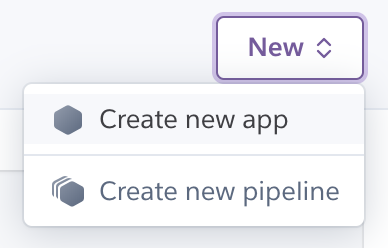

3. Give your app a name and click on **Create app**:

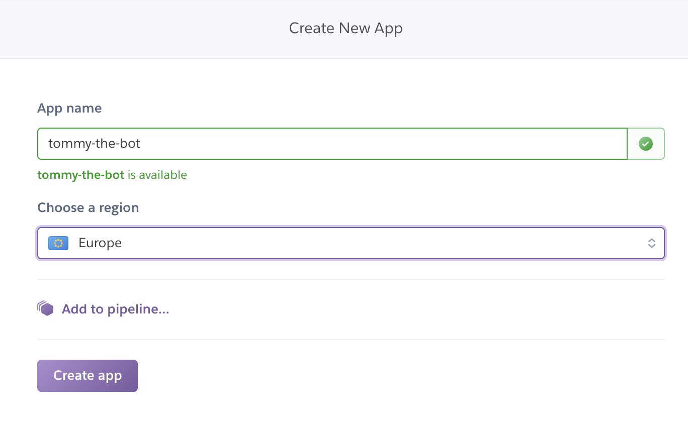

4. In your project, create a file named `Procfile` at the root folder and insert the following content:

```js
worker: node index.js
```

5. Follow the instructions provided by Heroku on the deployment tab:

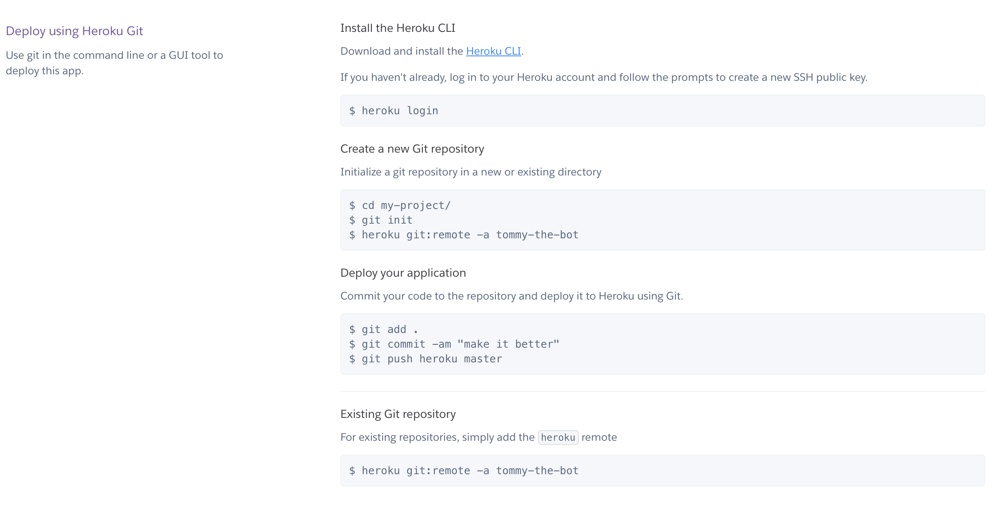

6. Finally, switch off the `web` process and switch on the `worker` process:


**Note**: We do so because we're running a **background task**.

Now, go back to your server and make sure you stopped running your bot locally. Is your bot online? Yes? **Congratulations**, you just built and deployed your first Discord bot.

If you miss something or if you want to browse the full code, head over this GitHub repository: [discord-bot-example](https://github.com/thomlom/discord-bot-example)

You can do endless things with that bot from there: ban users, play music, rank users, find GIFS, integrate it with many services (Google APIs, Unsplash for images, ...). **Have fun with your bot!** 😃
