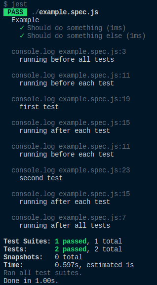
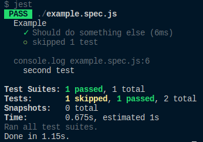
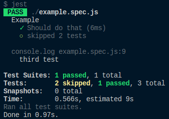
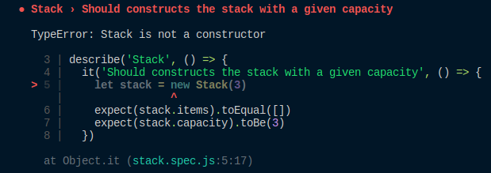
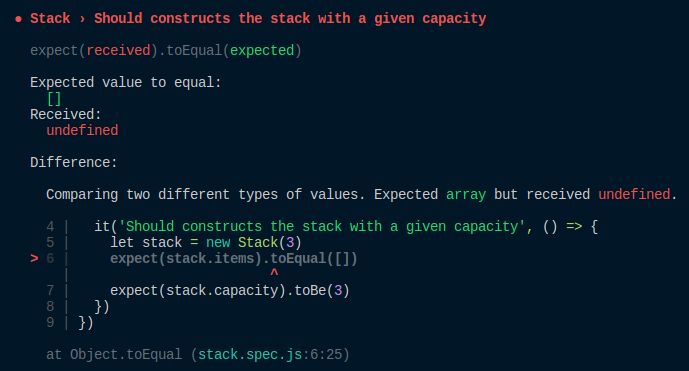
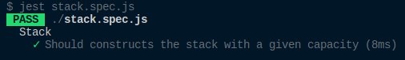
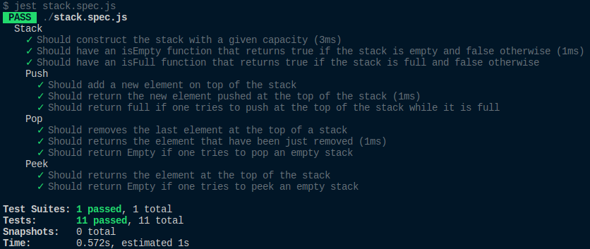

Testing is an important skill every developer should have. Still, some developers are reluctant to test.

We’ve all met at some point a developer who has said something like _"tests are useless"_, _"It takes too much effort"_ or _"I don’t doubt my code. Why waste my time on tests?"_. Don’t listen to them. **Testing is essential**.

One great reason is that tests make your code more stable and reduce your chances of getting bugs. You might think that this is not true because you know every little bit of your code. I mean, you built it, so why would you write tests on things you **already** know?

Well, let’s assume you are building a weather app. You’ve been coding for a few days or a few weeks, so you master your code.

Now let’s assume you stop building this app and you come back to it few months later. You won’t remember every detail of your old code. You’ll change it and, _damn_, something broke. How will you fix it? By looking at every file you created and tweaking them to get it working again? It may work. But geez, by changing this file, you broke something else.

Then, you’ll might think _"Whatever, I didn’t know how to code."_ I’ll just leave this app unchanged and I’ll move onto something else.”

Let’s take another example. After months of hard work, you finally landed that developer job you always wanted! You integrate into a team and you start building something. You work on others’ code and vice-versa. **And things will break**. If the team didn’t integrate tests in their app, I wish you good luck debugging it.

Every tech company should write tests when they build software or apps. So you don’t want to be that person who doesn’t know how to test and struggles with writing tests in the first weeks.

So, yes, writing tests takes time. Yes, it’s hard at first. Yes, building the app sounds more interesting. **But tests are essential and do save time when they are correctly implemented.**

This is my goal today: **improve your testing skills.** We will discover unit testing and test-driven development with [Jest](https://jestjs.io/en/) (a JavaScript testing tool) by creating a stack and testing it.

Of course there are other testing tools that you can use like [Mocha](https://mochajs.org/) and [Chai](https://www.chaijs.com/). But we can use Jest right out of the box, it’s fast and everything is built-in: assertion library, mocks, snapshot testing. So let’s stick to it.

## Unit Testing

When you decide to test an app, you encounter different types of testing: unit testing, integration tests and functional tests. We will focus on unit tests in this tutorial. Indeed, while functional and integration tests are important too, they are harder to setup and implement than unit tests. Besides, you already get a lot of value from unit tests.

In a nutshell, **unit test consist of testing small parts of your code: functions, classes methods, etc. You give them input and you verify that you get the expected output.**

Here are the advantages of unit testing:

- It makes your code more **stable.**
- It’s easier to **change the technical implementation** of a function without **modifying its behavior.**
- It **documents** your code. You’ll see why soon.
- It forces you to have a **great code design.** Indeed, poorly designed code is often harder to test.

## Test-Driven Development (TDD)

To understand and use test-driven development, apply these two rules:

- **Write a test that fails before even writing the code.**
- Then, **write no more code than is sufficient to pass the failing test.**

When we use TDD, we also talk about the **Red/Green/Refactor cycle:**

- Red: you write a failing test without writing the code.
- Green: write the simplest code to make the test pass. _Even if the code seems dumb or simple._
- Refactor: Refactor the code you’ve written if needed. Indeed, you made sure that what you tested has the correct behavior. No need to worry if you refactor the code, your unit tests will break if something goes wrong.

Sounds theoretical? Don’t worry. You’ll understand by practicing.

## Structuring a test file

Jest provides functions to structure your tests:

- `describe`: used for **grouping your tests and describing the behavior of your function/module/class.** It takes two parameters. The first one is a string describing your group. The second one is a callback function in which you have your test cases or hook functions.
- `it` or `test`: your test case, that is to say your unit test. The parameters are exactly the same as describe. It must be _descriptive._ The naming of your test is up to you but it’s pretty conventional to begin them with “Should
- `beforeAll` (`afterAll`): hook function that runs **before (and after) all tests.** It takes one parameter which is the function you will run before (and after) all tests.
- `beforeEach` (`afterEach`): hook function that runs **before (and after) each test.** It takes one parameter which is the function you will run before (and after) each test.

You must know also the following before writing any test:

- You can skip your test by using `.skip` on `describe` and `it` : `it.skip(...)` or `describe.skip(...)` . By using `.skip` , you’re telling Jest to ignore the test or group.
- You can select exactly which tests you want to run by using `.only` on `describe` and `it` : `it.only(...)` or `describe.only(...)`. It is useful if you have a lot of tests and want to focus on only one test or if you want to “debug” your tests.

## Setting up Jest

To show you the test functions we used above, we need to setup Jest. Don’t worry, it’s going to be dead simple.

As prerequisites, you only need [Node.js](https://nodejs.org/en/) and [npm](https://www.npmjs.com/) or [Yarn](https://yarnpkg.com/lang/en/). Make sure you use the latest version of Node.js as we will use ES6. Create a new directory and initialize it.

```sh
mkdir test-example && cd test-example
npm init -y
# OR
yarn init -y
```

The `-y` answers yes to all questions of npm or yarn . It should have generated a very basic `package.json` file.

Then add Jest into your developer dependencies:

```sh
yarn add jest --dev
```

Finally add the following script into your `package.json`:

```sh
"scripts": {
  "test": "jest"
}
```

`yarn test` will run your tests files in your directory. By default, Jest recognizes the files that are inside a directory called `__tests__` or the files that end either with `.spec.js` or `.test.js`. And that’s all. You’re ready to write your first tests.

## Matchers

When you test something, you need an input and an expected output. That’s why Jest provides matchers to test our values:

```js
expect(input).matcher(output)
```

Jest has a lot of matchers, so here are the most common ones:

- `toBe`: compares strict equality (`===`).

```js
expect(1 + 1).toBe(2)
let testsAreEssential = true
expect(testAreEssential).toBe(true)
```

- `toEqual`: compares values between two variables or arrays or objects.

```js
let arr = [1, 2]
arr.push(3)
expect(arr).toEqual([1, 2, 3])
let x = 1
x++
expect(x).toEqual(2)
```

- `toBeTruthy` (`toBeFalsy`): tells if the value is `true` (`false`).

```js
expect(null).toBeFalsy()
expect(undefined).toBeFalsy()
expect(false).toBeFalsy()

expect('Hello world').toBeTruthy()
expect({ foo: 'bar' }).toBeTruthy()
```

- `not`: has to be placed in front of a matcher and returns the opposite of the matcher’s result.

```js
expect(null).not.toBeTruthy()
// same as expect(null).toBeFalsy()

expect([1]).not.toEqual([2])
```

- `toContain`: checks if the array contains the element in parameter.

```js
expect(['Apple', 'Banana', 'Strawberry']).toContain('Apple')
```

- `toThrow`: checks if a function throws an error

```js
function connect() {
  throw new ConnectionError()
}

expect(connect).toThrow(ConnectionError)
```

These are not the only matchers. You can find all Jest matchers [here](https://jestjs.io/docs/en/expect#methods).

## First Tests

Now, we are going to write our first test and play around with our functions. First, create in your directory a file called `example.spec.js` and paste the following content:

```js
describe('Example', () => {
  beforeAll(() => {
    console.log('running before all tests')
  })
  afterAll(() => {
    console.log('running after all tests')
  })
  beforeEach(() => {
    console.log('running before each test')
  })
  afterEach(() => {
    console.log('running after each test')
  })
  it('Should do something', () => {
    console.log('first test')
  })
  it('Should do something else', () => {
    console.log('second test')
  })
})
```

Note that we don’t need to import all the functions we use. **They are already provided by Jest.**

Run `yarn test`:



As you don’t have assertions in your tests, they will just pass. Have you seen the different `console.log` statements? You should understand better how your hook functions and test cases work now.

Now, remove all the hook functions and add a `.skip` on the first test:

```js
describe('Example', () => {
  it.skip('Should do something', () => {
    console.log('first test')
  })
  it('Should do something else', () => {
    console.log('second test')
  })
})
```

Run `yarn test` again:



It’s logical since you skipped a test. The first one just won’t run.

Now add a third test to your test suite and use `.only` on it:

```js
describe('Example', () => {
  it('Should do something', () => {
    console.log('first test')
  })
  it('Should do something else', () => {
    console.log('second test')
  })
  it.only('Should do that', () => {
    console.log('third test')
  })
})
```

Run `yarn test` one more time:



Again, logical. You tell Jest to run your **third test only.** So you only see `third test` in the console.

## Testing a stack with test-driven development

No more theory. Time to practice. In the following, we will make a simple implementation of a stack in JavaScript with test-driven development.

As a reminder, a stack is a data structure, more precisely a LIFO structure: **Last In, First Out.** There are three main operations to perform on a stack:

- `push`: pushes an element at the top of a stack.
- `pop`: removes the element at the top of a stack.
- `peek`: returns the last element at the top of a stack.

In our case, we will create a class whose name will be `Stack`. To make things more complex, we will assume this stack has a **fixed capacity**. Here are the properties and functions of our stack implementation:

- `items`: the items of the stack. We’ll use an array to implement the stack.
- `capacity` : the capacity of the stack.
- `isEmpty()`: returns true if the stack is empty, false otherwise.
- `isFull()`: returns true if the stack has reached its maximum capacity, that is to say, when you can’t push another element. Returns false otherwise.
- `push(element)`: pushes an element onto the stack. Returns Full if the stack is full, the element is pushed otherwise.
- `pop()`: removes the last element of the stack. Returns Empty if the stack is empty, the element is popped otherwise.
- `peek()`: returns the element at the top of a stack (the last one pushed then). Returns Empty if the stack is empty, returns the element otherwise.

We are going to create two files `stack.js` and `stack.spec.js`. I used the `.spec.js` extension because I’m used to it but you’re free to use `.test.js` or give it another name and place it under `__tests__` if you want.

As we are doing test-driven development, let’s write the failing test. We are going to test the constructor first. To test your file, you need to import your stack file:

```js
const Stack = require('./stack')
```

For these who wonder why I haven’t used the `import` statement here, it’s because the latest stable version of Node.js doesn’t support it as of today. I could have added [Babel](https://babeljs.io/) but I don’t want to overload this tutorial. So let’s stick with `require`.

One good thing to do when you test a class or a function is to start your test by describing which file or class you are testing. Here, it’s about a stack:

```js
describe('Stack', () => {})
```

### Constructor

We need to test that when we initialize a stack, we create an empty array and we set the correct capacity. So in the `describe` block, we write the following test:

```js
it('Should constructs the stack with a given capacity', () => {
  let stack = new Stack(3)
  expect(stack.items).toEqual([])
  expect(stack.capacity).toBe(3)
})
```

Note that we use `toEqual` and not `toBe` for `stack.items` because they don’t reference the same array. So we need to compare their values only.

Now, run `yarn test stack.spec.js`. Note that we run Jest on a particular file because we don’t want to be polluted by the other tests. Here is the result:



`Stack is not a constructor`. Of course! We still haven’t created our Stack class and provided it a constructor.

Therefore, in `stack.js`, create your class, a constructor and export the class:

```js
class Stack {
  constructor() {}
}
module.exports = Stack
```

Run the test again:



As we haven’t set `items` in the constructor, Jest expected the `items` array to equal `[]` but it got `undefined`. You have to initialize the items then:

```js
constructor() {
  this.items = []
}
```

If you run the test again, you will get the same kind of error for `capacity`, so you’ll have to set the capacity too:

```js
constructor(capacity) {
  this.items = []
  this.capacity = capacity
}
```

Run our test one more time:



Yeah! **PASS**. Did you see how we wrote the solution? That’s what TDD is about. It covers your code at any time and lets you progress slowly towards the solution as you fix the failing tests. I hope testing makes more sense to you now! So, let’s continue, shall we?

### isEmpty

To test `isEmpty()`, we are going to initialize an empty stack, test if `isEmpty()` returns true, add an element, and test it again.

```js
it('Should have an isEmpty function that returns true if the stack is empty and false otherwise', () => {
  let stack = new Stack(3)
  expect(stack.isEmpty()).toBe(true)
  stack.items.push(2)
  expect(stack.isEmpty()).toBe(false)
})
```

If you run your test, you should get the following error:

```sh
TypeError: stack.isEmpty is not a function
```

To solve this problem, we will need to create isEmpty inside the Stack class:

```js
isEmpty () {}
```

If you run the test, you should get another error:

```sh
Expected: true
Received: undefined
```

Makes sense. Nothing is added inside `isEmpty`. A stack is empty if there are no items in it:

```js
isEmpty () {
  return this.items.length === 0
}
```

### isFull

This is the exact same thing as isEmpty, so as an exercise, test this function using test-driven development. You’ll find the solution at the very bottom of this tutorial.

### Push

We need to test three different things here:

- a new element should be added on top of the stack.
- `push` returns `"Full"` if the stack is full.
- the element recently pushed should be returned.

We are going to create another block using `describe` for push. Nest this block inside your main `describe` block.

```js
describe('Stack.push', () => {})
```

#### Adding an element

To test it, we will create a new stack and push an element. The last element of the `items` array should be the element you just added.

```js
describe('Stack.push', () => {
  it('Should add a new element on top of the stack', () => {
    let stack = new Stack(3)
    stack.push(2)
    expect(stack.items[stack.items.length - 1]).toBe(2)
  })
})
```

If you run the test, you see `push` is not defined, which is, one more time, perfectly normal. `push` will need a parameter to push something onto the stack:

```js
push (element) {
 this.items.push(element)
}
```

The tests pass again. Have you noticed something? We keep copy-pasting this line:

```js
let stack = new Stack(3)
```

It’s pretty annoying. Luckily for us, we have the `beforeEach` method that allows us to do some setup before each test run. Why not construct the stack in this method then?

```js
let stack

beforeEach(() => {
  stack = new Stack(3)
})
```

**Important:** the `stack` variable has to be declared before `beforeEach`. Indeed, if you define it in the `beforeEach` method, `stack` will be undefined in all the tests because it’s not in the right scope.

**Side note:** If we would have used beforeAllinstead of beforeEach, we would need to provide an afterEach method too. Indeed, the stack instance would be shared across all tests. That’s a problem since we push onto the stack, pop, etc. So, we would need to reset the stack after each test:

```js
afterEach(() => {
  stack.items = []
})
```

But here, as we are **creating a new stack instance before each test**, this `afterEach` method is not needed (but it's great to know it for future use cases).

**Back to testing:** You can remove the initialization of the stack in all the tests now. For these who feel a bit lost, here is the full test file up to this point:

```js
const Stack = require('./stack')

describe('Stack', () => {
  let stack
  beforeEach(() => {
    stack = new Stack(3)
  })
  it('Should constructs the stack with a given capacity', () => {
    expect(stack.items).toEqual([])
    expect(stack.capacity).toBe(3)
  })
  it('Should have an isEmpty function that returns true if the stack is empty and false otherwise', () => {
    stack.items.push(2)
    expect(stack.isEmpty()).toBe(false)
  })
  describe('Stack.push', () => {
    it('Should add a new element on top of the stack', () => {
      stack.push(2)
      expect(stack.items[stack.items.length - 1]).toBe(2)
    })
  })
})
```

#### Testing the returned value

For this test, we need to know if `push` returns the newly added element.

```js
it('Should return the new element pushed at the top of the stack', () => {
  let elementPushed = stack.push(2)
  expect(elementPushed).toBe(2)
})
```

When you run the test, you get:

```sh
Expected: 2
Received: undefined
```

Indeed. Nothing is returned inside `push`! We need to fix that:

```js
push(element) {
  this.items.push(element)
  return element
}
```

#### Returns full if the stack is full

In this test, we need to fill the stack first, push an element, verify that nothing has been pushed onto the stack and that the returned value is `Full`.

```js
it('Should return full if one tries to push at the top of the stack while it is full', () => {
  stack.items = [1, 2, 3]
  let element = stack.push(4)
  expect(stack.items[stack.items.length - 1]).toBe(3)
  expect(element).toBe('Full')
})
```

You should get this error when you run the test:

```sh
Expected: 3
Received: 4
```

So the element was pushed. That’s not what we want. We need to check first if the stack is full before adding something:

```js
push(element) {
  if (this.isFull()) {
    return 'Full'
  }

  this.items.push(element)
  return element
}
```

The tests pass now. Phew! We’re done with `push`.

### Exercise: pop and peek

I think you get how to do test-driven development now. So, as an exercise, test and implement `pop` and `peek`.

Some hints:

- `pop` is really similar to `push` test-wise.
- `peek` is really similar to `pop` test-wise too!
- Until now, we haven’t refactored the code, because there was no need to refactor it. In these functions, there may be a way to refactor your code after writing the tests and making them pass. No worries if you modify the code, the tests are here to let you know what’s wrong.

**Don’t look at the solution below without trying first. The only way to progress is by trying, experimenting and building things.**

### Solution

How was the exercise? Did you succeed? I hope so. If not, don’t worry, testing takes time and effort and tests are hard to write at first.

#### Stack.js

```js
class Stack {
  constructor(capacity) {
    this.items = []
    this.capacity = capacity
  }

  isEmpty() {
    return this.items.length === 0
  }

  isFull() {
    return this.items.length === this.capacity
  }

  push(element) {
    if (this.isFull()) {
      return 'Full'
    }
    this.items.push(element)
    return element
  }

  pop() {
    return this.isEmpty() ? 'Empty' : this.items.pop()
  }

  peek() {
    return this.isEmpty() ? 'Empty' : this.items[this.items.length - 1]
  }
}

module.exports = Stack
```

#### Stack.spec.js

```js
const Stack = require('./stack')

describe('Stack', () => {
  let stack

  beforeEach(() => {
    stack = new Stack(3)
  })

  it('Should construct the stack with a given capacity', () => {
    expect(stack.items).toEqual([])
    expect(stack.capacity).toBe(3)
  })

  it('Should have an isEmpty function that returns true if the stack is empty and false otherwise', () => {
    expect(stack.isEmpty()).toBe(true)
    stack.items.push(2)
    expect(stack.isEmpty()).toBe(false)
  })

  it('Should have an isFull function that returns true if the stack is full and false otherwise', () => {
    expect(stack.isFull()).toBe(false)
    stack.items = [4, 5, 6]
    expect(stack.isFull()).toBe(true)
  })

  describe('Push', () => {
    it('Should add a new element on top of the stack', () => {
      stack.push(2)
      expect(stack.items[stack.items.length - 1]).toBe(2)
    })

    it('Should return the new element pushed at the top of the stack', () => {
      let elementPushed = stack.push(2)
      expect(elementPushed).toBe(2)
    })

    it('Should return full if one tries to push at the top of the stack while it is full', () => {
      stack.items = [1, 2, 3]
      let element = stack.push(4)
      expect(stack.items[stack.items.length - 1]).toBe(3)
      expect(element).toBe('Full')
    })
  })

  describe('Pop', () => {
    it('Should removes the last element at the top of a stack', () => {
      stack.items = [1, 2, 3]
      stack.pop()
      expect(stack.items).toEqual([1, 2])
    })

    it('Should returns the element that have been just removed', () => {
      stack.items = [1, 2, 3]
      let element = stack.pop()
      expect(element).toBe(3)
    })

    it('Should return Empty if one tries to pop an empty stack', () => {
      // By default, the stack is empty
      expect(stack.pop()).toBe('Empty')
    })
  })

  describe('Peek', () => {
    it('Should returns the element at the top of the stack', () => {
      stack.items = [1, 2, 3]
      let element = stack.peek()
      expect(element).toBe(3)
    })

    it('Should return Empty if one tries to peek an empty stack', () => {
      // By default, the stack is empty
      expect(stack.peek()).toBe('Empty')
    })
  })
})
```

If you look at the files, you can see I used a ternary condition in pop and peek. That’s something **I refactored.** Indeed, the old implementation was:

```js
if (this.isEmpty()) {
  return 'Empty'
}

return this.items.pop()
```

As TDD allows us to refactor after the tests have been written, I found a shorter implementation **without worrying about the behavior of my tests.**

Run your tests one last time:



Not only your stack is tested, but you also have **documented your code** really well. Just by looking at the results of the tests, we can immediately see how your stack behaves.
