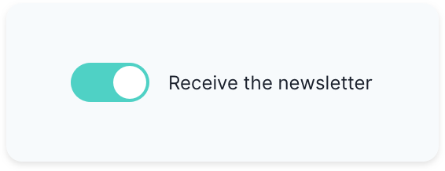
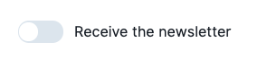
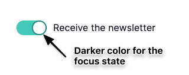
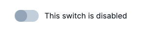
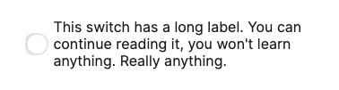
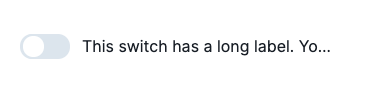

There are a lot of different UI components you can find on an app. The ones you'll find the most will probably be buttons, inputs, forms, or images. They are so common that HTML even provides default elements for them! However, it's not rare to encounter lesser-known components that you have to build by yourself.

That's what I had to do a few weeks ago for a toggle switch with Vue. I had to create one that is accessible, well-designed and where nothing's left to chance, something similar to the following:



Well, lucky you, today I'm going to share with you how you can do the same!

_Note: though I'm building it with Vue, the concepts can easily be applied to another framework such as React. Also, I'm using Vue 3 but don't be scared, there are not many differences with Vue 2 here!_ 😉

## A bit of conception

Before jumping straight to your keyboard and start coding, you have few things to take into consideration, especially the purpose of the switch. Indeed, a switch can be used in two ways:

1. To turn on or off something (as you would do with a light switch)
2. To select between two choices (a theme switcher for example)

It's very important to know which use case is the right one for you because it's going to impact the underlying implementation. In our case, we're going to go for the first use case.

Additionally, we want to be able to label a toggle switch so that the user knows what is going to happen if he toggles the switch or not.

Based on these various indications, we can already think of how we want to be able to use this component. Let's take a real-world example where a user would choose whether he wants to receive a newsletter or not. You can think of a first implementation where you would use different props: a `checked` prop and a `label` prop along with a `toggle` event:

```html
<Switch
  :checked="shouldReceiveNewsletter"
  @toggle="toggle"
  label="Receive newsletter"
/>
```

That's good. But we can do better by making use of [`v-model`](https://v3.vuejs.org/guide/component-custom-events.html#v-model-arguments) to simplify the use of the `checked` prop and the `toggle` event:

```html
<Switch v-model:checked="shouldReceiveNewsletter" label="Receive newsletter" />
```

You may be surprised by how I used `v-model`. Indeed, this is one of the differences with Vue 3. Instead of using the `model` object on the child component, you can use an argument name directly on the template. The code above passes a `checked` prop to `<Switch>` that you can update by emitting an `update:checked` event.

## Build the template

I'm going to paste here the screenshot again to remind you what we want to build:


Whenever you have to choose HTML elements, you need to choose the ones that make sense in terms of semantics. In our case, we'll have to use an [`input`](https://developer.mozilla.org/fr/docs/Web/HTML/Element/Input) as we're building a control. But which type to choose? Remember, we want to switch on/off a setting, that's a [checkbox](https://developer.mozilla.org/fr/docs/Web/HTML/Element/Input/checkbox)!

If we were to build a theme switcher, we would have gone for two radio inputs as it's more of a choice thing. Though there are no differences for the final user, it's important to balance the different implementations to make sure your component is accessible.

We also need to make sure our input is properly labeled. One way of doing so is to wrap an `<input>` in a `<label>` and to add some text in it.

Finally, we can also add a empty `<span>` that we're going to use later to build our toggle switch. Go ahead and create a `Switch.vue` in which you can paste the following:

```html
<template>
  <label>
    <input type="checkbox" />
    <span></span>
    <span>{{ label }}</span>
  </label>
</template>
```

## Props and v-model

We need to pass two props to the Switch: `label` which is a string and `checked` which is a boolean. Remember that the `checked` prop comes from `v-model:checked`:

```html
<template>
  <label>
    <input
      type="checkbox"
      :checked="checked"
      @change="$emit('update:checked', $event.target.checked)"
    />
    <span></span>
    <span>{{ label }}</span>
  </label>
</template>

<script>
  export default {
    name: "Switch",
    props: {
      label: {
        type: String,
        required: true,
      },
      checked: {
        type: Boolean,
        required: true,
      },
    },
  }
</script>
```

There's a problem with the input above. Indeed, the root element is different than the underlying input. Because of that, we have to create an additional prop for any additional attribute we want to pass to the input (`disabled` for example).

To fix it, we need to put a [`v-bind="$attrs"`](https://v3.vuejs.org/api/instance-properties.html#attrs) on the input and [disable attribute inheritance](https://v3.vuejs.org/guide/component-attrs.html#disabling-attribute-inheritance) on the root element:

```html
<input
  v-bind="$attrs"
  class="input"
  type="checkbox"
  @change="$emit('update:checked', $event.target.checked)"
  :checked="checked"
/>

<script>
  export default {
    name: "Switch",
    inheritAttrs: false,
    /* ... */
  }
</script>
```

## Style the container and the label

Here is what we have so far:


Let's face it, it's ugly as hell. We need to add CSS classes to the different elements to properly style them:

```html
<template>
  <label class="container">
    <input
      class="input"
      type="checkbox"
      :checked="checked"
      @change="$emit('update:checked', $event.target.checked)"
    />
    <span class="switch"></span>
    <span class="label">{{ label }}</span>
  </label>
</template>
```

We'll do them one by one. First the `.container`. We know the text is going to be on the right of the switch and we want it to be perfectly centered. We also want the whole toggle to be clickable so let's add a pointer cursor to it:

```html
<style scoped>
  .container {
    cursor: pointer;
    display: flex;
    align-items: center;
  }
</style>
```

We also need to give a prettier color to the label and give some space from the checkbox:

```css
.label {
  margin-left: 12px;
  color: #1a202c;
}
```

Then, though we use the `<input>` for semantic reasons, it won't be useful to us in terms of visuals. We need to hide it visually but still keep it in the DOM for accessibility reasons:

```css
/* Visually hide the checkbox input */
.input {
  position: absolute;
  width: 1px;
  height: 1px;
  padding: 0;
  margin: -1px;
  overflow: hidden;
  clip: rect(0, 0, 0, 0);
  white-space: nowrap;
  border-width: 0;
}
```

_Note: the properties are inspired by the `.sr-only` class from [Tailwind CSS](https://tailwindcss.com/docs/screen-readers)_

## Style the switch

Now is the time to style the switch itself. Let's add one more time the screenshot so that you don't have to scroll up again, again and again.


As you can see, the switch is composed of a rounded container element that has a circle inside of it that moves to the left or to the right depending on whether the input is checked or not.

If you look at the screenshot, you can see that the inner circle is roughly half the size of the container element. The container width has the twice the size of its own height. Let's make use of CSS custom properties for that:

```css
.switch {
  --switch-container-width: 50px;
  --switch-size: calc(var(--switch-container-width) / 2);
}
```

To create the inner circle, we're going to use the `::before` element trick. To make it inside the container, we'll need to give the container a `relative` position and the inner circle an `absolute` position.

Additionnally, the inner circle should be nearly the size of `--switch-size` but it shouldn't overflow the container. We'll use the [`calc`](https://developer.mozilla.org/en-US/docs/Web/CSS/calc) function to adjust it:

```css
.switch {
  --switch-container-width: 50px;
  --switch-size: calc(var(--switch-container-width) / 2);

  /* Vertically center the inner circle */
  display: flex;
  align-items: center;
  position: relative;
  height: var(--switch-size);
  flex-basis: var(--switch-container-width);
  /* Make the container element rounded */
  border-radius: var(--switch-size);
  background-color: #e2e8f0;
}

.switch::before {
  content: "";
  position: absolute;
  /* Move a little bit the inner circle to the right */
  left: 1px;
  height: calc(var(--switch-size) - 4px);
  width: calc(var(--switch-size) - 4px);
  /* Make the inner circle fully rounded */
  border-radius: 9999px;
  background-color: white;
}
```

Here is the result:



That's nice, but if you click on the switch nothing happens. At least, visually. Indeed, the input is properly checked but your switch isn't connected to the input!

To reflect these changes, you'll need to use the [CSS adjacent sibling selector](https://developer.mozilla.org/en-US/docs/Web/CSS/Adjacent_sibling_combinator), which is `+`, to style the switch according to the different input states. For example, when your checkbox is checked, the [`:checked`](https://developer.mozilla.org/en-US/docs/Web/CSS/:checked) pseudo-class is added. Let's make use of that then:

```css
.input:checked + .switch {
  /* Teal background */
  background-color: #4fd1c5;
}

.input:checked + .switch::before {
  border-color: #4fd1c5;
  /* Move the inner circle to the right */
  transform: translateX(
    calc(var(--switch-container-width) - var(--switch-size))
  );
}
```

The way the switch moves from one state to another isn't smooth. We need to add transitions to `transform` and `background-color` to fix it:

```css
.switch {
  /* ... */
  transition: background-color 0.25s ease-in-out;
}

.switch::before {
  /* ... */
  transition: transform 0.375s ease-in-out;
}
```

## Style the focus and disabled states

Right now, you should have a switch that works. But the work isn't fully done yet! Indeed, there are still different states to an input that we haven't implemented here. For example, if you press the `Tab` key to focus the switch, you don't have any visual feedback that it's properly focused. The same goes for disabled inputs.

As a first step, we're going to add additional CSS custom properties to `.switch` and replace the hardcoded colors:

```css
.switch {
  /* ... */

  --light-gray: #e2e8f0;
  --gray: #cbd5e0;
  --dark-gray: #a0aec0;
  --teal: #4fd1c5;
  --dark-teal: #319795;

  /* ... */
  background-color: var(--light-gray);
}

.input:checked + .switch {
  background-color: var(--teal);
}

.input:checked + .switch::before {
  border-color: var(--teal);
  /* ... */
}
```

_Note: the colors come from [Tailwind CSS](https://tailwindcss.com/docs/background-color) in case you're wondering._

Let's tackle the focus state. For that, we're not going to do anything complicated UI-wise, we'll just have to add a border on the inner circle:

```css
.switch::before {
  /* ... */
  border: 2px solid var(--light-gray);
}
```

Here, we chose the same color as the background of the switch container. Indeed, initially, we want the inner circle border color to confound with the background color. That way, when we adding a different `border-color` for the focus state, we'll be able to see it. We're going to add a darker `border-color` when the input is focused:

```css
.input:focus + .switch::before {
  border-color: var(--dark-gray);
}

.input:focus:checked + .switch::before {
  border-color: var(--dark-teal);
}
```

Here's how it looks:



For the disabled state, we're going to fill the inner circle with gray and make the switch container darker too to indicate that you can't do anything on it:

```css
.input:disabled + .switch {
  background-color: var(--gray);
}

.input:disabled + .switch::before {
  background-color: var(--dark-gray);
  border-color: var(--dark-gray);
}
```

Here's what our disabled switch looks like:



## Handle the switch's responsiveness

Pheeeew! That's a small piece of UI but it's not a trivial work. We have one last thing to check. Look at the screenshot below:



If you have a long label, you can see that the text overflows on the switch and that it may take multiple lines. That's not responsive, is it? Let's make sure our switch can't shrink and the label doesn't take more than one line:

```css
.switch {
  /* ... */
  /* In case the label gets long, the toggle shouldn't shrink. */
  flex-shrink: 0;
}

.label {
  /* ... */
  /* Show an ellipsis if the text takes more than one line */
  overflow: hidden;
  text-overflow: ellipsis;
  white-space: nowrap;
}
```

Now, our switch is responsive:



Voilà! We're done for the switch. In case, you want to have the full code, I put it in a GitHub Gist that you can get [here](https://gist.github.com/thomlom/4d2149161ec8c6d3fdfe530baf328c40), how nice is that? 😄
